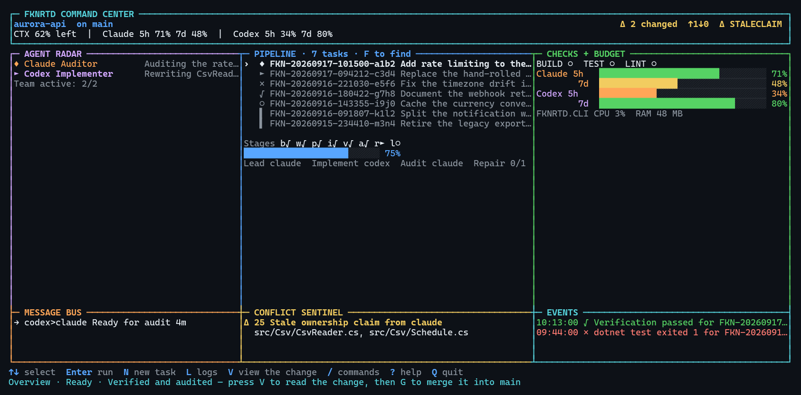
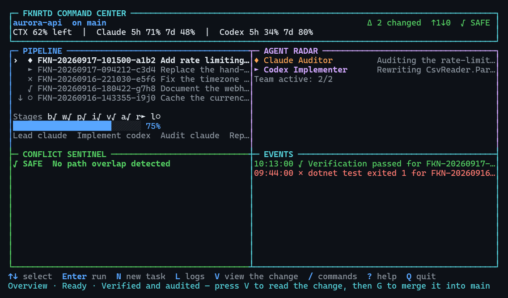
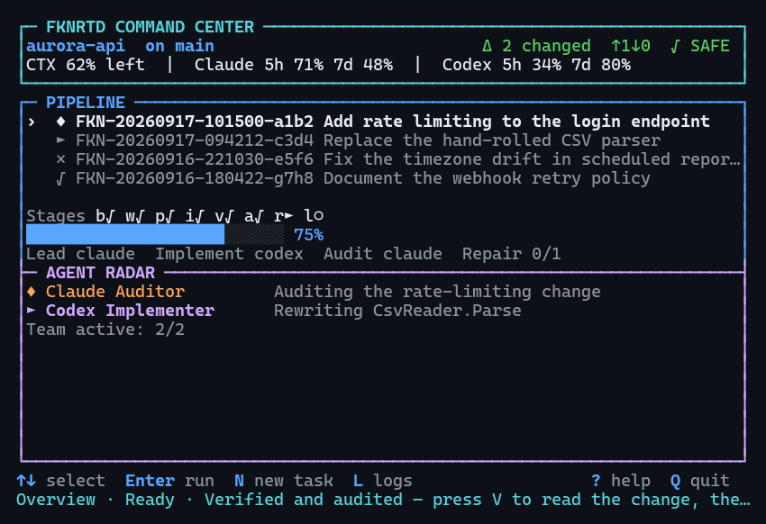
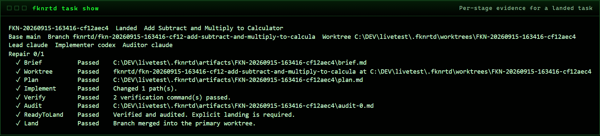
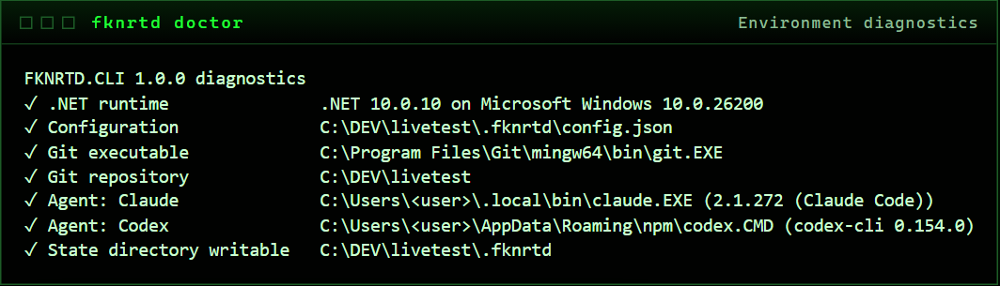
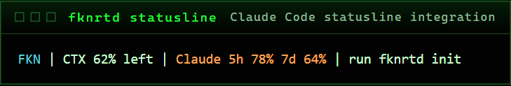
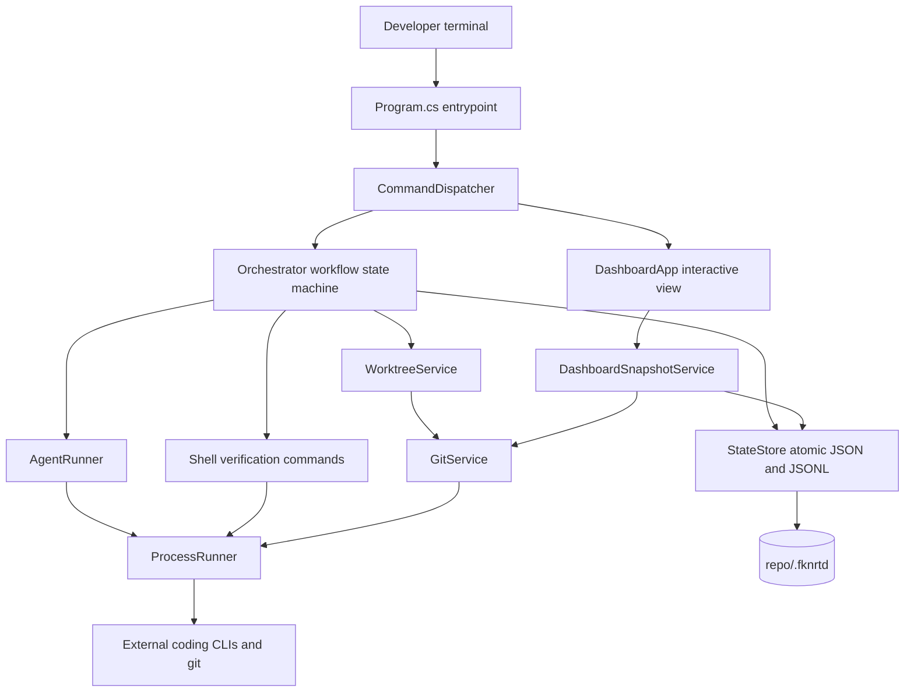
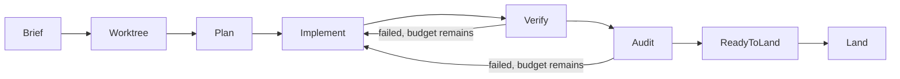

# FKNRTD.CLI

**A terminal command center for coding agents that are not trusted on their word.**

Several machines write code for you. None of them can be believed. This is the desk they all
report to: it isolates their work, runs the checks itself, makes a second machine review the
first, keeps the paperwork, and refuses to merge anything until you personally say the word.

`net10.0` &middot; **zero dependencies** &middot; command `fknrtd` &middot; 8 stages &middot;
34/34 self-tests &middot; MIT

> **The operator guide is [`fknrtd-portal.html`](fknrtd-portal.html)** — one self-contained page
> covering the pipeline, every command, every dashboard key and the full glossary. It opens from
> disk with no network. It is *generated* by `fknrtd portal` from the same tables the running
> program reads, so it cannot describe a command that was removed or a key that never existed.
> Regenerate it after upgrading.
>
> A styled single-page version of this README, with the same screenshots, is in
> [`fknrtd-cli.html`](fknrtd-cli.html).

## It explains itself

You are not expected to arrive knowing what a *brief*, a *lead* or an *auditor* is.

- Every field the task builder asks for arrives with its own definition and a worked example.
  Every field has a working default, so pressing Enter through the form produces a valid task.
- `?` opens the key reference and a searchable glossary of every word the product uses. `/` opens
  a command palette listing every action — including the ones you cannot take right now, each with
  the reason why.
- Destructive steps state what they are about to do, and where to read the diff first, before
  asking for the typed confirmation.
- From the shell, `fknrtd explain <word>` defines anything, `fknrtd help <command>` says what a
  command changes on disk and what to do next, and a mistyped command tells you which one you meant.

```
fknrtd                 open the command center here, setting the folder up if needed
fknrtd task new        describe a piece of work through a guided, explained form
fknrtd explain brief   what any word in this product means
fknrtd portal          write the offline guide
```



*The wide dashboard, captured from a live repository after a real task was planned by Claude,
implemented by Codex, verified, audited and landed. Nothing here is a mock-up.*

---

## The Rundown

FKNRTD.CLI coordinates several AI coding assistants (Claude Code, OpenAI Codex CLI, and any other
command-line coding tool you register) against a single project folder, usually a Git repository
but not necessarily one.

The core workflow is a supervised delivery pipeline. A task moves through eight stages: Brief,
Worktree, Plan, Implement, Verify, Audit, ReadyToLand, Land. Three roles are assigned per task: a
**Lead** plans, an **Implementer** writes the change, and a separate **Auditor** reviews it.
Implementation and audit are deliberately never the same seat, so a model never marks its own
homework. Nothing merges automatically: a finished task stops at `ReadyToLand` and waits for a
human to type a confirmation token. Each task runs inside its own Git branch and worktree, so
concurrent agents cannot overwrite each other's files, and a conflict sentinel plus a claim system
let agents reserve paths for read or write ahead of time. Remaining model capacity (context left,
five-hour and seven-day allowances per assistant) is surfaced continuously in the dashboard.

Under the hood this is three .NET projects sharing one solution (`FKNRTD.CLI.sln`): a core
library, a CLI executable, and a self-test harness, all targeting `net10.0` with nullable
reference types enabled and `TreatWarningsAsErrors` on. **There are zero third-party NuGet
dependencies** (no `PackageReference` exists anywhere in the tree), so the whole product is the
base class library and installs as one .NET global tool with no transitive supply chain. There is
no database and no ORM; all state is JSON and JSON Lines written atomically by
temp-file-plus-rename under `<repo>/.fknrtd/` (`src/FKNRTD.Core/Services/StateStore.cs`).
Concurrency is controlled with file-based exclusive leases, bounded by both attempt count and wall
clock. Every external process launch, whether an agent CLI or a verification command, goes through
one runner that enforces a timeout, kills the process tree on expiry, bounds output drain, and
reports launch failure as a result rather than throwing (`src/FKNRTD.Core/Services/ProcessRunner.cs`).
Git is driven by invoking the `git` executable, never a library. The dashboard renders to an
in-memory character grid and emits ANSI at three responsive breakpoints
(`src/FKNRTD.Cli/Dashboard/Canvas.cs`). FKNRTD.CLI holds no credentials of its own; each assistant
authenticates itself. Testing is a hand-rolled, dependency-free harness, not a framework
(`tests/FKNRTD.SelfTest/Program.cs`), currently 22 checks, all passing on this checkout.

There is no HTTP surface, no hosted service, and no CI/CD pipeline in this repository; it runs on
a developer machine against a local checkout and exposes no network endpoint. It is aimed at a
developer or small team running multiple coding assistants who need one place to see repository
state, agent activity, verification evidence and merge readiness.

**Where to start reading the code:** `src/FKNRTD.Cli/Program.cs` for startup,
`src/FKNRTD.Cli/Commands/CommandDispatcher.cs` for the command surface, and
`src/FKNRTD.Core/Services/Orchestrator.cs` for the workflow state machine.

## Last Updated

| Field | Value |
| --- | --- |
| Last Updated | 2026-09-15 |
| Last Commit Date | 2026-09-15T16:26:03-04:00 |
| Head Branch | `feature/standalone-workspaces-and-tool-management` |

## Table of Contents

- [The Rundown](#the-rundown)
- [Why This Exists](#why-this-exists)
- [Repository Overview](#repository-overview)
- [Screens](#screens)
- [Components](#components)
- [Architecture Overview](#architecture-overview)
- [The Three Seats](#the-three-seats)
- [Tech Stack and Dependencies](#tech-stack-and-dependencies)
- [Project Layout](#project-layout)
- [Getting Started](#getting-started-local-development)
- [Configuration](#configuration)
- [Running the System](#running-the-system)
- [Deployment and CI/CD](#deployment-and-cicd)
- [Deep Code Reference](#deep-code-reference)
- [Data and Integrations](#data-and-integrations)
- [Security Notes](#security-notes)
- [Observability and Monitoring](#observability-and-monitoring)
- [Common Tasks and Troubleshooting](#common-tasks-and-troubleshooting)
- [Effective Use](#effective-use)
- [Limits](#limits)
- [Change Log](#change-log)
- [Contributing and Coding Standards](#contributing-and-coding-standards)
- [License](#license)

## Why This Exists

An agent that says *"done, all tests pass"* has told you nothing. It has produced a sentence.
FKNRTD.CLI is built on the assumption that the sentence is worthless and only evidence counts.

So the tool never asks an agent whether the work is good. It runs the verification commands
**itself**, in a worktree it created, then hands the diff to a **different** agent for review.
When both pass, the task stops and waits for you.

| | |
| --- | --- |
| **Isolation** | Every task gets its own Git branch and worktree. Two agents working at once cannot overwrite each other, because they are not in the same directory. |
| **Deterministic proof** | Your verification commands are executed by the orchestrator, not by the agent that wrote the code. Exit codes are recorded. Output tails are kept. |
| **Adversarial review** | A second agent reads the real diff and must end with an exact verdict marker. An ambiguous verdict is treated as failure, never as a pass. |
| **Human landing** | Nothing merges on its own. A finished task sits in `ReadyToLand` until you type a confirmation token. |

**Design rule.** The command center is never the source of truth. Git holds the code, the agent
CLIs hold their own state, your test suite holds the verdict. This tool collects, correlates and
displays. When it disagrees with Git, Git is right.

## Repository Overview

A multi-component .NET solution of 30 first-party C# files totalling roughly 8,600 lines, plus
documentation, example configuration, two install scripts and a single-page operator manual.

## Screens

Nothing below is a mock-up. Each frame is the program's own output, captured from a working
repository in which a task had been planned, implemented, verified, audited and landed by real
agents, then rendered and photographed with a headless browser.

The layout reflows at three breakpoints, and a frame is always exactly the width you asked for,
measured in terminal columns rather than characters, so a CJK or emoji task title does not shear
the borders.

| Medium, 104 columns | Narrow, 78 columns |
| --- | --- |
|  |  |

Per-stage evidence for a task that actually completed:



Environment diagnostics, which report rather than throw:



The statusline inside Claude Code, with no remote call while rendering:



> **Reproduce these.** Every frame came from one command shape:
> `fknrtd dashboard -once -color -width W -height H`. The `-color` flag forces ANSI through a
> redirect, which is what makes capture possible; `-width` and `-height` make the result
> deterministic regardless of your terminal.

## Components

| Component | Type | Language / Framework | Runtime / Target | Path | Purpose |
| --- | --- | --- | --- | --- | --- |
| FKNRTD.Core | Library | C# / BCL only | net10.0 | `src/FKNRTD.Core` | Domain model, atomic state, process and Git runners, worktree isolation, orchestration, claims, messages, conflict detection, usage telemetry |
| FKNRTD.Cli | CLI executable (.NET tool) | C# / BCL only | net10.0 | `src/FKNRTD.Cli` | Argument parsing, command dispatch, dashboard, statusline, Claude Code integration |
| FKNRTD.SelfTest | Test harness | C# / BCL only | net10.0 | `tests/FKNRTD.SelfTest` | Dependency-free component and end-to-end validation |

`FKNRTD.Core` must not reference `FKNRTD.Cli`; the dependency runs one way (`AGENTS.md`).

## Architecture Overview



The task pipeline is a linear state machine with a bounded repair loop. Implement, Verify and Audit
reset and retry together when verification or audit fails, up to the task's repair budget. Exhaust
the budget and the task fails rather than degrading quietly.



| Stage | Owner | What actually happens |
| --- | --- | --- |
| **Brief** | orchestrator | Writes `brief.md` with the request and the acceptance commands. |
| **Worktree** | orchestrator | Creates branch `fknrtd/<task>-<title>` and an isolated worktree. |
| **Plan** | Lead | Read-only pass. Produces `plan.md`. Forbidden from editing. |
| **Implement** | Implementer | Writes code inside the worktree only. Changed paths recorded. |
| **Verify** | orchestrator | Runs your commands through the system shell. Exit codes and output tails stored. |
| **Audit** | Auditor | Reads the real diff. Must emit exactly one verdict marker. |
| **ReadyToLand** | orchestrator | Commits verified changes. Stops. Waits for a human. |
| **Land** | **you** | Merges `--no-ff` after every gate passes. |

**The verdict contract.** The auditor must finish with `FKNRTD_VERDICT: PASS` or
`FKNRTD_VERDICT: FAIL` alone on a line. The prompt contains both markers, so the orchestrator
strips its own prompt from the reply before counting. One PASS and zero FAIL is a pass. Anything
else, including both markers or neither, fails. Ambiguity never merges.

## The Three Seats

| Seat | Mode | Responsibility |
| --- | --- | --- |
| **Lead** | read-only | Plans. Inspects the repository, names the files that will change, states the risks. Produces no code. |
| **Implementer** | write | Writes the change inside the isolated worktree. Cannot merge, cannot leave the worktree. Its report is a claim, not evidence. |
| **Auditor** | read-only | Reads the diff and the verification results. Must return an explicit verdict. Should not be the agent that implemented. |

Any command-line coding tool can hold any seat. Claude Code and Codex CLI ship configured.

```sh
# arguments are an array, so there are no quoting rules to get wrong
fknrtd agent add -id gemini -exe gemini -arg=-p -arg="{prompt}"

# or supply a full definition with per-stage profiles
fknrtd agent add -file examples/generic-agent.json
```

Placeholders substituted at launch: `{prompt}`, `{taskId}`, `{workspace}`, `{branch}`. A profile
may deliver the prompt as an argument or on standard input.

> **Sandboxing is theirs, not ours.** Worktree isolation prevents agents colliding with each
> other. It is **not** a security boundary. Only the agent's own CLI can constrain what it touches;
> use its read-only or plan mode for the Plan and Audit seats.

## Tech Stack and Dependencies

| Layer | Choice |
| --- | --- |
| Language | C#, `LangVersion` latest |
| Target framework | `net10.0` |
| SDK pin | 10.0.100, `rollForward: latestFeature`, prerelease disallowed (`global.json`) |
| Third-party packages | **None** |
| Nullable reference types | Enabled |
| Warnings | `TreatWarningsAsErrors` |
| Distribution | .NET global tool, command `fknrtd` |
| Test framework | None; hand-rolled harness |

External runtime requirements, invoked as executables rather than linked:

- .NET 10 SDK
- Git 2.28 or newer, for worktree isolation. Optional: a standalone workspace needs no Git.
- At least one configured coding CLI. Built-in defaults are `claude` and `codex`.

## Project Layout

```
FKNRTD.CLI/
  - AGENTS.md                      project invariants for AI agents
  - CHANGELOG.md
  - Directory.Build.props          shared build settings
  - FKNRTD.CLI.sln
  - LICENSE                        MIT
  - README.md
  - VALIDATION.md                  what was actually tested
  - fknrtd-cli.html                styled single-page operator manual
  - global.json                    SDK pin
  - docs/
    - ARCHITECTURE.md
    - COMMANDS.md
    - screenshots/                 captured application frames
  - examples/
    - claude-statusline-input.json
    - generic-agent.json
  - scripts/
    - manage.cmd                   Windows install, update, uninstall, doctor
    - manage.sh                    POSIX install, update, uninstall, doctor
  - src/
    - FKNRTD.Cli/
      - Program.cs                 entrypoint, terminal setup, error handling
      - Commands/                  CliArguments, CommandDispatcher, FknrtdRuntime, StatusLineRenderer
      - Dashboard/                 Canvas, DashboardApp, Theme
    - FKNRTD.Core/
      - Domain/                    Configuration, Enums, Models
      - Services/                  orchestration, state, git, process, claims, messages
      - Telemetry/                 UsageService
  - tests/
    - FKNRTD.SelfTest/
      - Program.cs                 all self-tests
```

## Getting Started (Local Development)

Build and run the suite:

```sh
dotnet build FKNRTD.CLI.sln -c Release
dotnet run --project tests/FKNRTD.SelfTest/FKNRTD.SelfTest.csproj -c Release --no-build
```

The harness prints one line per check and a final `N/N self-tests passed` count, exiting 0 only
when every check passes. Verified on this checkout: `22/22 self-tests passed`.

Install as a global tool. One management script per platform covers the whole lifecycle:

```sh
scripts\manage.cmd install       # Windows
./scripts/manage.sh install      # POSIX
```

| Action | Effect |
| --- | --- |
| `install` | Pack `src/FKNRTD.Cli` into `artifacts/` and install the global tool |
| `update` | Pack and move the installed tool to this checkout |
| `uninstall` | Remove the global tool; project `.fknrtd/` state is kept |
| `doctor` | Diagnose the installation and say what to do next |
| `help` | Show the usage text |

`install` refuses when the tool is already present and points you at `update`. `update` installs
when nothing is there yet, and reinstalls in place when the version number has not moved, which is
what makes it work as an update route from a working checkout, since `dotnet tool update` is a
no-op against an unchanged version. Both accept `-verify` to build and run the local self-test
suite before installing, and `-no-pack` to install from `artifacts/` without packing again.

`scripts/manage.* doctor` diagnoses the **installation**: the SDK, the version this checkout
builds, the version installed, whether `fknrtd` resolves on `PATH` and actually runs. It exits
non-zero when something needs attention. `fknrtd doctor` is the different, inner command that
diagnoses a **workspace**. Restart the terminal if `fknrtd` is not immediately on `PATH`.

Initialise a repository:

```sh
fknrtd init
git add .fknrtd/config.json .fknrtd/.gitignore
git commit -m "Configure FKNRTD.CLI"
fknrtd doctor
```

`init` detects your verification commands where it can. Commit the config: it is reviewable
project policy, and an uncommitted state directory will block landing later.

Or just open the folder you are standing in:

```sh
fknrtd
```

With no arguments, `fknrtd` opens the dashboard using the default loading parameters, creating the
workspace first if there is not one yet. It looks for an existing workspace in the current folder
and above it, so running from a subdirectory finds the project you are already in. When there is
none anywhere, it creates one at the Git repository root if you are inside a repository, and in
the current folder if you are not: a subdirectory is never the right project root when a
repository encloses it. Run `fknrtd .` to pin it to the current folder regardless.

### Projects that will never be on GitHub

A Git repository is not a prerequisite. If the folder is not a repository, or Git is not
installed at all, `init` provisions a **standalone** workspace, and `-standalone` forces one even
inside a repository. Pass `-git` when you want the opposite: a hard failure rather than a silent
fallback.

What changes in a standalone workspace:

| Git-backed | Standalone |
| --- | --- |
| Each task gets its own branch and worktree | Agents work directly in the project folder |
| Verified changes are auto-committed | Nothing is committed; the files are the deliverable |
| Landing merges the task branch | Landing records that the verified work is already in place |
| `task cleanup` removes the worktree and branch | Nothing to remove |
| Changed paths come from `git diff` | Changed paths are not tracked |
| `doctor` requires Git | `doctor` reports Git as optional |

Everything else is unchanged: the same briefs, the same lead/implementer/auditor split, the same
deterministic verification, the same independent audit, and the same refusal to land anything that
did not pass both. You lose isolation between concurrent tasks and the ability to roll a task back
by discarding a branch, so keep to one task at a time unless the folder is under version control.

Commission and run a task:

```sh
fknrtd task create "Add JWT validation" \
  -brief "Validate the signature and expiry on every inbound request. Reject with 401.
          Do not change the login path." \
  -verify "dotnet test" \
  -lead claude -implementer codex -auditor claude

fknrtd task run FKN-20260915-163416-cf12aec4
fknrtd task show FKN-20260915-163416-cf12aec4
fknrtd task land FKN-20260915-163416-cf12aec4 -confirm LAND
```

**What landing checks before it will move:** the primary worktree is clean, you are on the task's
base branch, verification passed, the audit returned a single PASS, and you typed `-confirm LAND`.
Any one missing and the merge is refused with the reason.

## Configuration

Configuration lives at `<repo>/.fknrtd/config.json`.

| Key | Default | Meaning |
| --- | --- | --- |
| `mode` | `git` | Workspace mode: `git` (isolated worktrees) or `standalone` (no Git isolation) |
| `defaultBaseRef` | current branch | Base new task branches fork from |
| `maxParallelAgents` | 4 | Concurrent dashboard task cap |
| `defaultMaxRepairRounds` | 1 | Repair attempts before a task fails |
| `agentTimeoutSeconds` | 3600 | Per-agent process timeout |
| `verificationTimeoutSeconds` | 600 | Per-verification-command timeout |
| `agentStaleAfterSeconds` | 120 | Age at which agent state is stale |
| `claimStaleAfterSeconds` | 300 | Age at which a file claim is stale |
| `dashboardRefreshMilliseconds` | 1000 | Refresh interval |
| `requireCleanTreeForLanding` | true | Block landing on a dirty primary worktree |
| `autoCommitAgentChanges` | true | Commit verified changes automatically |
| `defaultVerificationCommands` | detected | Commands applied to new tasks |
| `agents` | claude, codex | Registered agent definitions |

(`src/FKNRTD.Core/Domain/Configuration.cs`)

> **Treat this file as code.** Verification commands are executed through `cmd.exe` on Windows or
> `/bin/sh` elsewhere. A careless edit to `config.json` is arbitrary code execution on your
> machine. Review changes to it as you would a build script, and commit it so the change is
> visible.

No environment variables configure behaviour. The process reads `PATH`, `PATHEXT` and `COMSPEC`
only, to find executables and pick a shell. It stores no credentials.

## Running the System

| Command | Effect |
| --- | --- |
| `scripts/manage.* install \| update \| uninstall \| doctor` | Manage the global tool installation |
| `fknrtd` | Open the current folder, initializing it if needed |
| `fknrtd init [path]` | Create configuration, Git-backed or standalone |
| `fknrtd init -standalone` | Force a workspace with no Git isolation |
| `fknrtd doctor` | Check runtime, Git, config, writable state, agent executables |
| `fknrtd dashboard` | Open the interactive command center |
| `fknrtd dashboard -once` | Render one frame and exit |
| `fknrtd dashboard -once -color -width W -height H` | Render a deterministic coloured frame for capture |
| `fknrtd status` | One frame; exit code **3** signals a live collision |
| `fknrtd status -json` | Complete normalised snapshot for scripts |
| `fknrtd config show \| path \| validate` | Inspect and validate configuration |
| `fknrtd task create "Title" -brief ... -verify ...` | Commission a task |
| `fknrtd task list \| show \| run \| retry \| cancel` | Task lifecycle |
| `fknrtd task land <id> -confirm LAND` | Merge verified, audited work |
| `fknrtd task cleanup <id> -confirm REMOVE` | Remove the worktree and branch |
| `fknrtd agent list \| add \| enable \| disable` | Manage registered agents |
| `fknrtd message send \| list` | Agent-to-agent message bus |
| `fknrtd claim add \| list \| renew \| release` | Reserve paths for read or write |
| `fknrtd usage refresh \| list \| set` | Capacity telemetry |
| `fknrtd integration install-claude-statusline` | Install the statusline into Claude Code |

**Dashboard keys.** Up/Down select, Enter run, `N` new, `C` cancel, `G` land, `M` message,
`L` logs, `U` usage, Tab view, `Q` quit.

Breakpoints: narrow below 84 columns, medium to 119, wide at 120 and above. Redirect the output and
it renders a single frame instead of taking the terminal.

## Deployment and CI/CD

There is **no CI/CD pipeline in this repository.** No `.github/workflows`, no `azure-pipelines.yml`,
no `Jenkinsfile`, no GitLab CI configuration, no `Dockerfile` and no infrastructure-as-code.

Deployment is local tool installation only. A self-contained single-file executable can also be
produced:

```sh
dotnet publish src\FKNRTD.Cli\FKNRTD.Cli.csproj -c Release -r win-x64 --self-contained true -p:PublishSingleFile=true -o publish\win-x64
```

Verification is the local suite. Per `AGENTS.md`, that suite is the only accepted evidence of
correctness; GitHub Actions results, where a workflow exists at all, are never used for reporting
or gating.

## Deep Code Reference

### Cross-Reference Index

| Module / Class | File | Notes |
| --- | --- | --- |
| `Program` | `src/FKNRTD.Cli/Program.cs` | UTF-8 encoding, ANSI enablement on Windows, exit 130 on cancellation |
| `CliArguments` | `src/FKNRTD.Cli/Commands/CliArguments.cs` | Single-dash options, `-name=value`, `--` terminator; numeric values not mistaken for flags |
| `CommandDispatcher` | `src/FKNRTD.Cli/Commands/CommandDispatcher.cs` | Central command switch and help text |
| `FknrtdRuntime` | `src/FKNRTD.Cli/Commands/FknrtdRuntime.cs` | Composition root |
| `StatusLineRenderer` | `src/FKNRTD.Cli/Commands/StatusLineRenderer.cs` | Degrades when the project is uninitialised |
| `DashboardApp` | `src/FKNRTD.Cli/Dashboard/DashboardApp.cs` | `Render` is a pure function and the renderer test seam |
| `Canvas` | `src/FKNRTD.Cli/Dashboard/Canvas.cs` | Character-cell grid, display-width aware; ANSI only when colour is on |
| `Orchestrator` | `src/FKNRTD.Core/Services/Orchestrator.cs` | Stage machine, repair loop, verdict evaluation |
| `StateStore` | `src/FKNRTD.Core/Services/StateStore.cs` | Atomic writes, JSONL tail reads, rotation, leases |
| `ExclusiveFileLease` | `src/FKNRTD.Core/Services/StateStore.cs` | Bounded by attempts and wall clock; reports the holding PID |
| `ProcessRunner` | `src/FKNRTD.Core/Services/ProcessRunner.cs` | Timeout, tree kill, bounded drain, launch-failure results |
| `ExecutableLocator` | `src/FKNRTD.Core/Services/ProcessRunner.cs` | PATH and PATHEXT resolution |
| `GitService` | `src/FKNRTD.Core/Services/GitService.cs` | Shells out to `git`; NUL-terminated path lists |
| `WorktreeService` | `src/FKNRTD.Core/Services/WorktreeService.cs` | Branch and worktree lifecycle; aborts a failed merge |
| `AgentRunner` | `src/FKNRTD.Core/Services/AgentRunner.cs` | Resolves a profile, expands placeholders, holds the agent lease |
| `ClaimService` | `src/FKNRTD.Core/Services/ClaimService.cs` | Path claims and collision classification |
| `TaskService` | `src/FKNRTD.Core/Services/TaskService.cs` | Task identity (`FKN-` prefix) and lifecycle |
| `DoctorService` | `src/FKNRTD.Core/Services/DoctorService.cs` | Diagnostics that report rather than throw |
| `WorkspaceLocator` | `src/FKNRTD.Core/Services/WorkspaceLocator.cs` | Walks up to find `.fknrtd`; resolves the primary worktree |
| `UsageService` | `src/FKNRTD.Core/Telemetry/UsageService.cs` | Claude statusline payload and Codex rate-limit parsing |

The repository exposes no HTTP routes, controllers or network endpoints. The only external
interface is the command line, so there is no API Surface section to fill in.

## Data and Integrations

There is no database. All persistence is files under `<repo>/.fknrtd/`.

| Path | Contents | Committed |
| --- | --- | --- |
| `.fknrtd/config.json` | Project configuration | yes |
| `.fknrtd/tasks/` | One JSON document per task | no |
| `.fknrtd/artifacts/<task>/` | brief.md, plan.md, audit-N.md | no |
| `.fknrtd/logs/<task>/` | Per-stage process logs, written live | no |
| `.fknrtd/runtime/events.jsonl` | Append-only event history, rotated | no |
| `.fknrtd/runtime/messages.jsonl` | Append-only message bus | no |
| `.fknrtd/runtime/claims/` | Active file claims | no |
| `.fknrtd/runtime/locks/` | Exclusive leases, PID recorded | no |
| `.fknrtd/worktrees/` | Isolated per-task Git worktrees | no |

Writes are atomic: temporary file, then rename. History is JSON Lines, read from the tail and
rotated past a size cap, so a long-lived project does not make the dashboard slower every day.

Integrations are all local process invocations: `git`, and each configured coding CLI. Claude Code
integration additionally reads the statusline JSON payload Claude Code supplies on standard input.

## Security Notes

- **No credentials are stored or handled.** Each assistant authenticates itself.
- Verification commands from `config.json` execute through the system shell. That file is
  effectively executable project policy; review and commit it.
- Agent arguments are passed as an argument array rather than a shell string, avoiding shell
  injection at the agent-launch boundary.
- Worktree isolation is collision avoidance, not a security sandbox. An agent process can still
  reach the wider filesystem; only the assistant's own sandbox constrains that.
- Landing is gated: clean primary worktree by default, matching base branch, passing verification,
  passing audit, and an explicit `-confirm LAND`.
- The Claude integration writes a timestamped backup before modifying an existing settings file.

## Observability and Monitoring

- Per-task, per-stage process logs under `.fknrtd/logs/`, written live.
- Append-only event and message history as JSON Lines, tail-read and rotated.
- Verification evidence per command: exit code, duration, output tail.
- Dashboard panels for agent activity, pipeline progress, quality signals, messages, conflicts and
  events.
- `fknrtd status -json` emits a complete machine-readable snapshot.
- There is no metrics endpoint, no log shipping and no distributed tracing.

## Common Tasks and Troubleshooting

| Symptom | What it means |
| --- | --- |
| Landing blocked: uncommitted changes | The primary worktree is dirty. Commonly the `.fknrtd/` directory never committed after `init`. |
| Landing blocked: wrong branch | You are not on the task's base branch. |
| Agent shows Offline | Its executable did not resolve on `PATH`. Run `doctor`. |
| Task is busy / lease held | Another process owns it. The message names the holding process id. |
| Audit failed with a sound-looking report | The verdict marker was missing, duplicated, or both appeared. Read `audit-N.md`. |
| Commit refused, no identity | `user.name` and `user.email` are unset in that repository. |
| Agent ran forever | It did not. It was killed at `agentTimeoutSeconds` and partial output was kept. |
| `fknrtd` not found after install | Restart the terminal so `PATH` is refreshed. |
| Reinstall did not pick up a rebuild | `dotnet tool update` is a no-op at the same version. Bump the version or uninstall first. |

Cancellation is a file marker: `fknrtd task cancel <id>` requests it and running stages observe it
within half a second. A cancelled task can be resumed with `task retry`.

## Effective Use

The difference between a useful run and an expensive one.

**1. A brief is a contract, not a wish.** The single largest quality lever. Name the files. State
what must not change. Give acceptance criteria as commands, not adjectives. "Improve error
handling" produces an expensive mess; "Wrap every call in `PaymentClient` so a timeout returns
`Result.Failure`, do not change the retry policy, `dotnet test` must pass" produces a diff you can
review in a minute.

**2. Never let one agent implement and audit.** A model reviewing its own work agrees with itself.
Put a different vendor in the Auditor seat if you can, a different model at minimum. This is the
entire point of the tool; collapsing the seats turns it into an expensive script runner.

**3. Give it a real verification command.** With no commands the Verify stage is skipped and the
audit becomes the only gate, which puts you back to trusting prose. A build alone is weak evidence.

> **Watch for empty evidence.** A verification command that passes without doing anything is worse
> than none, because it looks like proof. `dotnet test` against a project with no tests exits zero.
> Check that your gate can fail before you trust it.

**4. Keep the repair budget low.** The default is one round and that is usually right. An agent
that could not satisfy a clear brief and a failing test in two attempts will not find it on the
fifth; it will write increasingly speculative code while spending your allowance. A failed task
with evidence beats a passed task with damage.

**5. Mind the agent lease.** An agent runs one task at a time, enforced by an exclusive lease. If
Claude holds both Lead and Auditor and you start several tasks at once, they serialise, and a long
first task can make a later one fail on lease timeout. Spread the seats across agents before
raising `maxParallelAgents`.

**6. Read the evidence, not the summary.** When something looks wrong, go to the artifacts. The
plan says what the Lead intended, the audit says what the Auditor found, the logs say what the
process printed. Each is a file with no interpretation layer.

**7. Land deliberately.** The confirmation token is not ceremony. It is the last point at which a
human reads a diff that three machines have agreed about. Read it.

**Task shapes that work well:** bounded refactors, adding a method to an existing class, migrating
a call-site pattern, adding tests to an untested unit, mechanical renames, fixing a reproducible
bug with a failing test attached.

**Badly:** open-ended design, anything needing product judgement, work whose acceptance cannot be
expressed as a command, changes spanning many modules at once, anything where you cannot describe
"done" in a sentence.

## Limits

- **It is not a sandbox.** Worktrees stop agents colliding. They do not stop an agent reaching the
  rest of your filesystem.
- **It cannot make a bad brief good.** Vague instructions produce vague diffs, faster and at
  greater expense than doing it yourself.
- **An audit is a second opinion, not a proof.** A model can approve wrong code convincingly. The
  deterministic commands are the hard evidence; the audit is judgement on top.
- **Verification is only as good as your commands.** The tool records exit codes faithfully. It
  cannot tell that your test suite asserts nothing.
- **Display width is terminal-dependent.** Layout follows East Asian wide and fullwidth plus emoji
  presentation. A terminal with different ambiguous-width rules will disagree.
- **POSIX paths are unverified.** Development and validation ran on Windows. The `/bin/sh`
  execution path has not been exercised on Linux or macOS; `scripts/manage.sh` was run under Git
  Bash on Windows only.
- **No telemetry leaves your machine.** No server, no endpoint, no metrics exporter.

Every figure in this document was produced by running the command on a real machine against a real
commit. Where something was not measured, it is not claimed. See
[`VALIDATION.md`](VALIDATION.md) for the record and its stated limits.

## Change Log

Tracked in full in [`CHANGELOG.md`](CHANGELOG.md). Summary below; see that file for exact wording.

### Unreleased

**Added**

- Standalone workspaces: `fknrtd init` no longer requires a Git repository. A non-repository
  folder, or a machine with no Git at all, is provisioned in standalone mode, where agents work
  directly in the project folder, nothing is committed or merged, and landing records that the
  verified work is already in place. `-standalone` forces the mode; `-git` demands a repository
  and fails without one. Recorded as `mode` in `.fknrtd/config.json`, defaulting to `git`.
- Bare invocation (`fknrtd` with no arguments) opens the dashboard against the current folder,
  provisioning a workspace first if none exists, searching upward from the current folder, and
  rooting at the enclosing Git repository when one is present. `fknrtd .` pins it to the current
  folder regardless.
- `fknrtd doctor` reports workspace mode and treats Git checks as informational, not failing, in a
  standalone workspace.
- `scripts/manage.cmd` and `scripts/manage.sh` replace the old `scripts/install.*` scripts, adding
  `update`, `uninstall` and `doctor` alongside `install`, plus `-verify` and `-no-pack` flags.

**Fixed**

- The colour-forcing self-test read `NO_COLOR` from the invoking terminal and failed on any
  machine that sets it; it now pins the variable for the duration of the test.

### 1.0.0 - 2026-09-15

First shippable revision, renamed from its working title (`Synergia`) to FKNRTD.CLI throughout.

**Fixed**

- Unbounded file-lease retries, unhandled launch-failure exceptions, wrong PATHEXT resolution
  order, missing process timeouts, unbounded post-exit output drain, unbounded in-memory event
  history, and concurrent log read/write faults.
- Audit-verdict corruption from an agent echoing its own prompt; base refs resolving to the
  literal `HEAD` instead of a branch; mangled Git paths containing spaces or non-ASCII characters;
  commit failures with no Git identity surfacing raw stderr; orphaned worktree state after cleanup.
- Terminal rendering assumed one character equalled one display column, shearing borders on CJK or
  emoji content; truncation could split a surrogate pair; adjacent panels drew doubled seams; the
  pipeline viewport could scroll the selected task out of view.

**Added**

- `AgentTimeoutSeconds` and `VerificationTimeoutSeconds` configuration keys.
- `OutputTruncated` on command results.
- `-width` and `-height` on `dashboard -once` and `status` for deterministic capture; `-color` to
  force ANSI through a redirect.
- Self-test coverage grew from 5 checks to 19.
- `AGENTS.md` recording the project invariants.

**Documentation**

- Added `fknrtd-cli.html`, the single-page operator manual. Rewrote `README.md` and `VALIDATION.md`
  as evidence-based documents in which every substantive claim cites the file it came from.

## Contributing and Coding Standards

Project invariants are recorded in [`AGENTS.md`](AGENTS.md) and are binding for both human and AI
contributors:

- Zero third-party NuGet dependencies. Do not add `PackageReference` entries.
- `TreatWarningsAsErrors` is on. Fix the cause rather than suppressing a warning.
- Nullable reference types stay enabled; the target framework stays `net10.0`.
- `FKNRTD.Core` must not reference `FKNRTD.Cli`.
- All state writes go through `StateStore`; never write state files directly.
- All external process launches go through `ProcessRunner`.
- `DashboardApp.Render` must remain a pure function of its arguments.
- Never assume one `char` equals one terminal column.
- Add a self-test for every behaviour change.
- Attribution in commits and licence headers is nullcromancer.
- The local suite is the only accepted evidence. CI results are not used for reporting or gating.

## License

MIT License. Copyright (c) 2026 nullcromancer. See [`LICENSE`](LICENSE).

---

*The work is not done because a machine said so. It is done because it was checked.*
