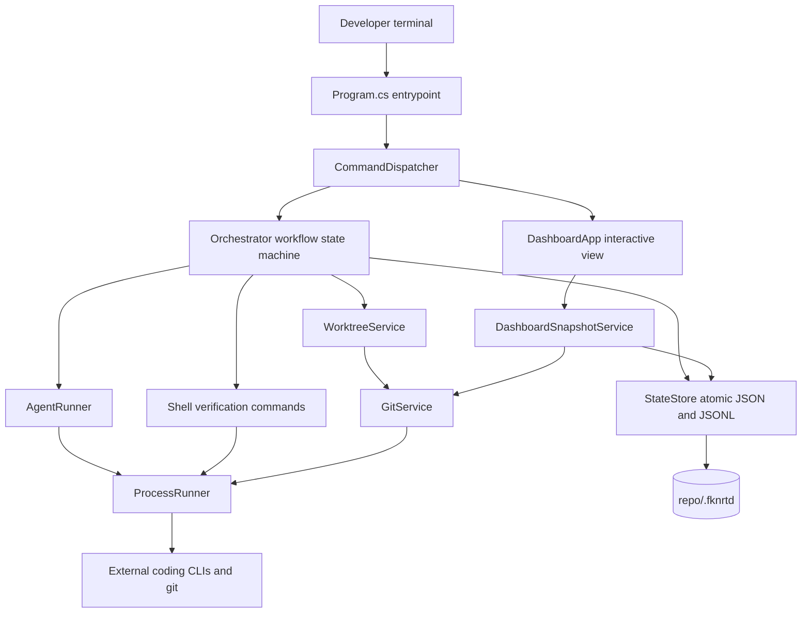
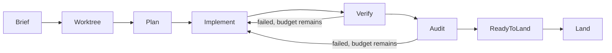

# Business Analyst Summary

- FKNRTD.CLI is a terminal command center that coordinates several AI coding assistants
  (Claude Code, OpenAI Codex CLI, and any other command-line coding tool that can be
  registered) against a single Git repository
  (`src/FKNRTD.Cli/Commands/CommandDispatcher.cs`).
- The core workflow is a supervised delivery pipeline. A task moves through eight stages:
  Brief, Worktree, Plan, Implement, Verify, Audit, ReadyToLand, Land
  (`src/FKNRTD.Core/Domain/Enums.cs`).
- Three roles are assigned per task: a Lead agent plans, an Implementer agent writes the
  change, and a separate Auditor agent reviews it. Implementation and audit are
  deliberately not performed by the same seat
  (`src/FKNRTD.Core/Services/Orchestrator.cs`).
- Nothing merges automatically. A task reaches ReadyToLand and stops; merging requires an
  explicit, separately confirmed command (`src/FKNRTD.Core/Services/Orchestrator.cs`).
- Each task runs inside its own isolated Git worktree and branch, so concurrent agents
  cannot overwrite each other's files (`src/FKNRTD.Core/Services/WorktreeService.cs`).
- Evidence is retained rather than summarised away: the brief, the plan, per-round audit
  reports, verification command output and per-stage logs are all written to disk under
  the project's state directory (`src/FKNRTD.Core/Services/StateStore.cs`).
- A conflict sentinel warns when two agents touch overlapping paths, and a file-claim
  system lets agents reserve paths for read or write
  (`src/FKNRTD.Core/Services/ClaimService.cs`).
- Remaining model capacity is surfaced continuously: context remaining, five-hour
  allowance and seven-day allowance per assistant
  (`src/FKNRTD.Core/Telemetry/UsageService.cs`).
- Operational impact is local only. The tool runs on a developer machine against a local
  checkout; it is not a hosted service and exposes no network endpoint.
- Who uses it: an individual developer or a small team running multiple coding assistants
  who need one place to see repository state, agent activity, verification evidence and
  merge readiness.

# Technical Summary

- Three .NET projects: a core library, a CLI executable, and a self-test harness
  (`FKNRTD.CLI.sln`).
- Target framework is `net10.0` for all projects, with `LangVersion` set to `latest`,
  nullable reference types enabled, and `TreatWarningsAsErrors` on
  (`Directory.Build.props`).
- **Zero third-party NuGet dependencies.** No `PackageReference` exists in any project
  file. The entire product is built on the base class library, which is why it installs
  as a single tool with no transitive supply chain.
- Ships as a .NET global tool. `PackageId` is `FKNRTD.CLI`, and the assembly and command
  are both `fknrtd` (`src/FKNRTD.Cli/FKNRTD.Cli.csproj`).
- Hosting model: a local console application. There is no server, no container, no
  infrastructure-as-code and no CI pipeline in this repository.
- Data layer: there is no database and no ORM. All state is JSON and JSON Lines files
  written atomically by temp-file-plus-rename under `<repo>/.fknrtd/`
  (`src/FKNRTD.Core/Services/StateStore.cs`).
- Concurrency control is file-based: exclusive file leases guard per-task and per-agent
  work, and acquisition is bounded by attempt count and wall clock
  (`src/FKNRTD.Core/Services/StateStore.cs`).
- Every external process launch is funnelled through one runner that enforces a timeout,
  kills the process tree on expiry, bounds output drain, and reports launch failure as a
  result rather than an exception (`src/FKNRTD.Core/Services/ProcessRunner.cs`).
- Git is driven by invoking the `git` executable, not by a library
  (`src/FKNRTD.Core/Services/GitService.cs`).
- The dashboard renders to an in-memory character grid and emits ANSI escapes, with three
  responsive breakpoints (`src/FKNRTD.Cli/Dashboard/Canvas.cs`).
- Authentication is delegated entirely. FKNRTD.CLI holds no credentials and performs no
  login; each configured assistant authenticates itself.
- Testing is a hand-rolled, dependency-free harness rather than a framework: an
  executable that runs a list of checks and prints a pass count
  (`tests/FKNRTD.SelfTest/Program.cs`).
- Observability is local files plus an interactive view. There is no metrics exporter and
  no distributed tracing.
- **Where to start:** `src/FKNRTD.Cli/Program.cs` for process startup,
  `src/FKNRTD.Cli/Commands/CommandDispatcher.cs` for the command surface, and
  `src/FKNRTD.Core/Services/Orchestrator.cs` for the workflow state machine.

# FKNRTD.CLI

A dependency-free C# terminal command center for coordinating multiple coding CLIs.

## Last Updated

| Field | Value |
| --- | --- |
| Last Updated | 2026-09-15 |
| Last Commit Date | 2026-09-15T13:25:26-04:00 |
| Head Revision | `8692e64f65b71c5cf3608ebcabcaf722f6cc1f81` |
| Head Branch | `main` |

## Table of Contents

- [Business Analyst Summary](#business-analyst-summary)
- [Technical Summary](#technical-summary)
- [Repository Overview](#repository-overview)
- [Components](#components)
- [Architecture Overview](#architecture-overview)
- [Tech Stack and Dependencies](#tech-stack-and-dependencies)
- [Project Layout](#project-layout)
- [Getting Started (Local Development)](#getting-started-local-development)
- [Configuration](#configuration)
- [Running the System](#running-the-system)
- [Deployment and CI/CD](#deployment-and-cicd)
- [Deep Code Reference](#deep-code-reference)
- [Data and Integrations](#data-and-integrations)
- [Security Notes](#security-notes)
- [Observability and Monitoring](#observability-and-monitoring)
- [Common Tasks and Troubleshooting](#common-tasks-and-troubleshooting)
- [Contributing and Coding Standards](#contributing-and-coding-standards)
- [License](#license)

## Repository Overview

FKNRTD.CLI turns several independent coding assistants into one supervised pipeline over
a single Git repository. Rather than trusting an assistant's own claim that work is done,
the tool separates the seat that implements from the seat that audits, runs deterministic
verification commands itself, keeps the resulting evidence on disk, and refuses to merge
anything until a human asks for it explicitly.

The design rule stated in `docs/ARCHITECTURE.md` is that the command center never becomes
the source of truth by accident. Git and the assistants themselves hold the truth; this
tool collects, correlates and displays it.

Repository shape: a multi-component .NET solution of 30 first-party C# files totalling
roughly 8,200 lines, plus documentation, example configuration, two install scripts and a
single-page operator manual (`fknrtd-cli.html`).

## Components

| Component | Type | Language/Framework | Runtime/Target | Path | Purpose |
| --- | --- | --- | --- | --- | --- |
| FKNRTD.Core | Library | C# / BCL only | net10.0 | `src/FKNRTD.Core` | Domain model, atomic state store, process and Git runners, worktree isolation, workflow orchestration, claims, messages, conflict detection, usage telemetry |
| FKNRTD.Cli | CLI executable (.NET tool) | C# / BCL only | net10.0 | `src/FKNRTD.Cli` | Argument parsing, command dispatch, interactive dashboard, statusline renderer, Claude Code integration |
| FKNRTD.SelfTest | Test harness (executable) | C# / BCL only | net10.0 | `tests/FKNRTD.SelfTest` | Dependency-free component and end-to-end validation |

`FKNRTD.Core` must not reference `FKNRTD.Cli`; the dependency runs one way
(`src/FKNRTD.Cli/FKNRTD.Cli.csproj`, `AGENTS.md`).

## Architecture Overview



The task pipeline is a linear state machine with a bounded repair loop. Implement, Verify
and Audit are reset and retried together when verification or audit fails, up to the
task's repair budget (`src/FKNRTD.Core/Services/Orchestrator.cs`).



## Tech Stack and Dependencies

| Layer | Choice | Evidence |
| --- | --- | --- |
| Language | C#, `LangVersion` latest | `Directory.Build.props` |
| Target framework | `net10.0` | all three `.csproj` files |
| SDK pin | 10.0.100, `rollForward: latestFeature`, prerelease disallowed | `global.json` |
| Third-party packages | None | no `PackageReference` in any project file |
| Nullable reference types | Enabled | `Directory.Build.props` |
| Warnings | `TreatWarningsAsErrors` enabled | `Directory.Build.props` |
| Distribution | .NET global tool, `PackageId` `FKNRTD.CLI`, command `fknrtd` | `src/FKNRTD.Cli/FKNRTD.Cli.csproj` |
| Test framework | None; hand-rolled harness | `tests/FKNRTD.SelfTest/Program.cs` |

External runtime requirements, invoked as executables rather than linked:

- .NET 10 SDK.
- Git 2.28 or newer, required for worktree isolation
  (`src/FKNRTD.Core/Services/GitService.cs`).
- At least one configured coding CLI. The built-in defaults are `claude` and `codex`
  (`src/FKNRTD.Core/Domain/Configuration.cs`).

## Project Layout

```
FKNRTD.CLI/
  - AGENTS.md                      project invariants for AI agents
  - CHANGELOG.md
  - Directory.Build.props          shared build settings
  - FKNRTD.CLI.sln
  - LICENSE                        MIT
  - README.md
  - VALIDATION.md
  - global.json                    SDK pin
  - docs/
    - ARCHITECTURE.md
    - COMMANDS.md
  - examples/
    - claude-statusline-input.json sample statusline payload
    - generic-agent.json           sample custom agent definition
  - scripts/
    - install.cmd                  Windows pack and install
    - install.sh                   POSIX pack and install
  - src/
    - FKNRTD.Cli/
      - Program.cs                 entrypoint, terminal setup, top-level error handling
      - Commands/                  CliArguments, CommandDispatcher, FknrtdRuntime, StatusLineRenderer
      - Dashboard/                 Canvas, DashboardApp, Theme
    - FKNRTD.Core/
      - Domain/                    Configuration, Enums, Models
      - Services/                  orchestration, state, git, process, claims, messages
      - Telemetry/                 UsageService
  - tests/
    - FKNRTD.SelfTest/
      - Program.cs                 all self-tests
```

## Getting Started (Local Development)

Build and run the test suite:

```
dotnet build FKNRTD.CLI.sln -c Release
dotnet run --project tests/FKNRTD.SelfTest/FKNRTD.SelfTest.csproj -c Release --no-build
```

The self-test harness prints one line per check and a final `N/N self-tests passed`
count, exiting 0 only when every check passes (`tests/FKNRTD.SelfTest/Program.cs`).

Install as a global tool:

```
scripts\install.cmd
```

```
./scripts/install.sh
```

Both scripts pack `src/FKNRTD.Cli/FKNRTD.Cli.csproj` into an `artifacts` directory, then
install or update the global tool `FKNRTD.CLI`. Restart the terminal if `fknrtd` is not
immediately on `PATH`.

Initialise a repository:

```
fknrtd init
git add .fknrtd/config.json .fknrtd/.gitignore
git commit -m "Configure FKNRTD.CLI"
fknrtd doctor
```

`fknrtd init` requires an existing Git repository
(`src/FKNRTD.Cli/Commands/CommandDispatcher.cs`).

## Configuration

Configuration lives at `<repo>/.fknrtd/config.json` and is written on `init`
(`src/FKNRTD.Core/Services/StateStore.cs`). Keys, with defaults from
`src/FKNRTD.Core/Domain/Configuration.cs`:

| Key | Default | Meaning |
| --- | --- | --- |
| `schemaVersion` | 1 | Configuration schema version |
| `projectName` | empty | Display name for the project |
| `defaultBaseRef` | `HEAD` | Base ref new tasks branch from |
| `maxParallelAgents` | 4 | Cap on concurrently running dashboard tasks |
| `defaultMaxRepairRounds` | 1 | Repair rounds allowed per task |
| `agentStaleAfterSeconds` | 120 | Age after which agent state is treated as stale |
| `claimStaleAfterSeconds` | 300 | Age after which a file claim is treated as stale |
| `agentTimeoutSeconds` | 3600 | Per-agent process timeout |
| `verificationTimeoutSeconds` | 600 | Per-verification-command timeout |
| `dashboardRefreshMilliseconds` | 1000 | Dashboard refresh interval |
| `requireCleanTreeForLanding` | true | Block landing when the primary worktree is dirty |
| `autoCommitAgentChanges` | true | Commit verified agent changes automatically |
| `defaultVerificationCommands` | empty | Commands applied to new tasks |
| `agents` | Claude and Codex | Registered agent definitions |

Each agent definition carries an id, display name, kind, executable, enabled flag, colour,
an environment map, and a set of named command profiles. A profile supplies an argument
array, a prompt-delivery mode, and optional success and failure markers
(`src/FKNRTD.Core/Domain/Configuration.cs`). Arguments are arrays rather than a shell
string, so no quoting rules apply. The placeholders `{prompt}`, `{taskId}`, `{workspace}`
and `{branch}` are substituted at launch (`src/FKNRTD.Core/Services/AgentRunner.cs`).

Treat `config.json` as executable project policy: verification commands run through
`cmd.exe` on Windows or `/bin/sh` elsewhere, so changes to it deserve review
(`docs/ARCHITECTURE.md`, `src/FKNRTD.Core/Services/ProcessRunner.cs`).

No environment variables are read for configuration. The process reads `PATH`, `PATHEXT`
and `COMSPEC` only, for executable resolution and shell selection
(`src/FKNRTD.Core/Services/ProcessRunner.cs`).

## Running the System

Command surface, from `src/FKNRTD.Cli/Commands/CommandDispatcher.cs` and
`docs/COMMANDS.md`:

| Command | Purpose |
| --- | --- |
| `fknrtd init [path]` | Create default configuration in an existing Git repository |
| `fknrtd doctor` | Check .NET, Git, configuration, writable state and configured executables |
| `fknrtd dashboard` | Open the interactive command center |
| `fknrtd dashboard -once` | Render a single frame and exit |
| `fknrtd status` | Render one frame; exit code 3 signals a live collision |
| `fknrtd status -json` | Emit a complete normalised snapshot |
| `fknrtd dashboard -once -color -width W -height H` | Render a deterministic coloured frame for capture |
| `fknrtd config show \| path \| validate` | Inspect and validate configuration |
| `fknrtd task create "Title" -brief "..." -verify "..."` | Create a task |
| `fknrtd task list \| show \| run \| retry \| cancel` | Task lifecycle |
| `fknrtd task land <id> -confirm LAND` | Merge a verified, audited task branch |
| `fknrtd task cleanup <id> -confirm REMOVE [-force]` | Remove a task worktree |
| `fknrtd agent list \| add \| enable \| disable` | Manage registered agents |
| `fknrtd message send \| list` | Agent-to-agent message bus |
| `fknrtd claim add \| list \| renew \| release` | File claims |
| `fknrtd usage refresh \| list \| set` | Capacity telemetry |
| `fknrtd integration install-claude-statusline` | Install the statusline into Claude Code settings |

Destructive operations require an explicit confirmation token: landing requires
`-confirm LAND`, cleanup requires `-confirm REMOVE`.

Interactive dashboard keys, from `src/FKNRTD.Cli/Dashboard/DashboardApp.cs`: Up and Down
select, Enter runs, N creates, C cancels, G lands, M sends a message, L toggles logs, U
refreshes usage, Tab switches view, Q or Escape quits.

The dashboard uses three responsive breakpoints: narrow below 84 columns, medium from 84
to 119, and wide at 120 and above (`src/FKNRTD.Cli/Dashboard/DashboardApp.cs`). When
output or input is redirected it renders a single frame instead of entering the
interactive loop.

## Deployment and CI/CD

There is **no CI/CD pipeline in this repository.** No `.github/workflows`, no
`azure-pipelines.yml`, no `Jenkinsfile`, no GitLab CI configuration, no `Dockerfile`, no
container compose file and no infrastructure-as-code were found.

Deployment is local tool installation only, by `scripts/install.cmd` or
`scripts/install.sh`. A self-contained single-file executable can also be produced:

```
dotnet publish src\FKNRTD.Cli\FKNRTD.Cli.csproj -c Release -r win-x64 --self-contained true -p:PublishSingleFile=true -o publish\win-x64
```

Verification is the local suite. Per `AGENTS.md`, that local suite is the only accepted
evidence of correctness.

## Deep Code Reference

### Cross-Reference Index

| Module/Class | File Path | Key Methods | Notes |
| --- | --- | --- | --- |
| `Program` | `src/FKNRTD.Cli/Program.cs` | top-level statements, `Terminal.EnableVirtualTerminal` | Sets UTF-8 encoding, enables ANSI on Windows, maps cancellation to exit code 130 |
| `CliArguments` | `src/FKNRTD.Cli/Commands/CliArguments.cs` | `Get`, `GetMany`, `Has`, `GetInt`, `GetDouble` | Single-dash options, `-name=value` form, `--` terminator; numeric values are not mistaken for flags |
| `CommandDispatcher` | `src/FKNRTD.Cli/Commands/CommandDispatcher.cs` | `ExecuteAsync` | Central command switch and help text |
| `FknrtdRuntime` | `src/FKNRTD.Cli/Commands/FknrtdRuntime.cs` | constructor wiring | Composition root; builds services from a resolved `FknrtdPaths` |
| `StatusLineRenderer` | `src/FKNRTD.Cli/Commands/StatusLineRenderer.cs` | `RenderAsync` | Renders the Claude Code statusline; degrades when the project is uninitialised |
| `DashboardApp` | `src/FKNRTD.Cli/Dashboard/DashboardApp.cs` | `RunAsync`, `Render`, `HandleKeyAsync` | `Render` is a pure function of snapshot, width, height and colour flag; it is the renderer test seam |
| `Canvas` | `src/FKNRTD.Cli/Dashboard/Canvas.cs` | `DrawText`, `DrawBox`, `DrawGauge`, `Render` | Character-cell grid; emits ANSI only when colour is enabled |
| `Orchestrator` | `src/FKNRTD.Core/Services/Orchestrator.cs` | `RunAsync`, `LandAsync` | Stage machine, repair loop, audit verdict evaluation |
| `StateStore` | `src/FKNRTD.Core/Services/StateStore.cs` | `SaveTaskAsync`, `AppendEventAsync`, `AcquireTaskLeaseAsync` | Atomic writes, JSONL tail reads, rotation, exclusive leases |
| `ExclusiveFileLease` | `src/FKNRTD.Core/Services/StateStore.cs` | `AcquireAsync`, `Dispose` | Bounded by attempts and wall clock; reports the holding process id |
| `ProcessRunner` | `src/FKNRTD.Core/Services/ProcessRunner.cs` | `RunAsync`, `RunShellAsync` | Timeout, process-tree kill, bounded output drain, launch-failure results |
| `ExecutableLocator` | `src/FKNRTD.Core/Services/ProcessRunner.cs` | `Find` | PATH and PATHEXT resolution, preferring extension matches on Windows |
| `GitService` | `src/FKNRTD.Core/Services/GitService.cs` | `GetSnapshotAsync`, `GetChangedPathsAsync`, `GetDiffPathsAsync` | Shells out to `git` |
| `WorktreeService` | `src/FKNRTD.Core/Services/WorktreeService.cs` | `CreateAsync`, `LandAsync`, `RemoveAsync` | Branch and worktree lifecycle; aborts a failed merge |
| `AgentRunner` | `src/FKNRTD.Core/Services/AgentRunner.cs` | `RunAsync`, `ExpandArguments` | Resolves a profile, expands placeholders, holds an agent lease |
| `AgentOutputObserver` | `src/FKNRTD.Core/Services/AgentOutputObserver.cs` | `ObserveAsync` | Derives live agent state from streamed output |
| `ClaimService` | `src/FKNRTD.Core/Services/ClaimService.cs` | add, renew, release, conflict detection | Path claims and collision classification |
| `MessageService` | `src/FKNRTD.Core/Services/MessageService.cs` | send, list | Append-only agent message bus |
| `TaskService` | `src/FKNRTD.Core/Services/TaskService.cs` | `CreateAsync`, `RequestCancellationAsync` | Task identity (`FKN-` prefix) and lifecycle |
| `DashboardSnapshotService` | `src/FKNRTD.Core/Services/DashboardSnapshotService.cs` | `CaptureAsync` | Single consistent snapshot for rendering |
| `DoctorService` | `src/FKNRTD.Core/Services/DoctorService.cs` | `RunAsync` | Environment diagnostics that report rather than throw |
| `WorkspaceLocator` and `FknrtdPaths` | `src/FKNRTD.Core/Services/WorkspaceLocator.cs` | `Find`, `ForRoot` | Walks up to find `.fknrtd`; resolves the primary worktree from a linked one |
| `UsageService` | `src/FKNRTD.Core/Telemetry/UsageService.cs` | usage capture and parsing | Claude statusline payload and Codex rate-limit parsing |
| `ClaudeIntegrationService` | `src/FKNRTD.Core/Services/ClaudeIntegrationService.cs` | statusline install | Backs up existing settings before modifying |

No API surface section is included: the repository exposes no HTTP routes, controllers or
network endpoints. The only external interface is the command line.

<details>
<summary>Domain enumerations</summary>

From `src/FKNRTD.Core/Domain/Enums.cs`:

- `WorkflowStage`: Brief, Worktree, Plan, Implement, Verify, Audit, ReadyToLand, Land
- `WorkflowStatus`: Queued, Running, Waiting, Failed, ReadyToLand, Landed, Cancelled
- `StageState`: Pending, Running, Passed, Failed, Skipped
- `AgentRole`: Observer, Lead, Implementer, Auditor
- `AgentActivityState`: Unknown, Offline, Idle, Planning, Running, Reviewing, Waiting,
  Blocked, Failed, Completed
- `ClaimMode`: Read, Write

</details>

## Data and Integrations

There is no database. All persistence is files under `<repo>/.fknrtd/`
(`src/FKNRTD.Core/Services/WorkspaceLocator.cs`):

| Path | Contents |
| --- | --- |
| `.fknrtd/config.json` | Project configuration; intended to be committed |
| `.fknrtd/tasks/` | One JSON document per task |
| `.fknrtd/runtime/agents/` | Live agent state |
| `.fknrtd/runtime/usage/` | Cached capacity snapshots |
| `.fknrtd/runtime/claims/` | Active file claims |
| `.fknrtd/runtime/locks/` | Exclusive lease files |
| `.fknrtd/runtime/cancels/` | Cancellation request markers |
| `.fknrtd/runtime/events.jsonl` | Append-only event history |
| `.fknrtd/runtime/messages.jsonl` | Append-only message history |
| `.fknrtd/logs/` | Per-task, per-stage process logs |
| `.fknrtd/artifacts/` | Brief, plan and per-round audit reports |
| `.fknrtd/worktrees/` | Isolated per-task Git worktrees |

Everything except `config.json` and the generated `.gitignore` is excluded from Git
(`src/FKNRTD.Core/Services/StateStore.cs`).

Integrations are all local process invocations: `git`, and each configured coding CLI.
Claude Code integration additionally reads the statusline JSON payload that Claude Code
supplies on standard input, and can install a statusline entry into Claude Code settings
(`src/FKNRTD.Core/Services/ClaudeIntegrationService.cs`). The statusline renderer makes no
remote call while rendering.

## Security Notes

- **No credentials are stored or handled.** FKNRTD.CLI performs no authentication; each
  configured assistant authenticates itself independently.
- A secret scan across 129 scanned files produced 9 candidate matches, all high-entropy
  string patterns. None was confirmed as a live credential, and several are explicitly
  example or test data. No secret values are reproduced here.
- Verification commands from `config.json` are executed through the system shell. A
  malicious or careless edit to that file is equivalent to arbitrary code execution on
  the developer machine, which is why `docs/ARCHITECTURE.md` instructs treating it as
  reviewable project policy.
- Agent arguments are passed as an argument array rather than a shell string, avoiding
  shell injection at the agent-launch boundary
  (`src/FKNRTD.Core/Services/AgentRunner.cs`).
- Worktree isolation is a collision-avoidance mechanism, not a security sandbox. An agent
  process can still reach the wider filesystem; only the assistant's own sandbox can
  constrain that (`docs/ARCHITECTURE.md`).
- Landing is gated: it requires a clean primary worktree by default, a matching base
  branch, passing verification, a passing audit, and an explicit `-confirm LAND`.
- `ClaudeIntegrationService` writes a timestamped backup before modifying an existing
  Claude Code settings file.

## Observability and Monitoring

- Per-task, per-stage process logs under `.fknrtd/logs/`, written live as the process
  emits output (`src/FKNRTD.Core/Services/ProcessRunner.cs`).
- Append-only event and message history as JSON Lines, read from the tail and rotated
  once past a size cap (`src/FKNRTD.Core/Services/StateStore.cs`).
- Verification evidence retained per command: exit code, duration and an output tail
  (`src/FKNRTD.Core/Services/Orchestrator.cs`).
- Interactive dashboard panels for agent activity, pipeline progress, quality signals,
  messages, conflicts and events (`src/FKNRTD.Cli/Dashboard/DashboardApp.cs`).
- `fknrtd status -json` emits a complete machine-readable snapshot for external tooling.
- There is no metrics endpoint, no structured log shipping and no distributed tracing.

## Common Tasks and Troubleshooting

| Situation | Action |
| --- | --- |
| `fknrtd` not found after install | Restart the terminal so `PATH` is refreshed |
| Unsure whether the environment is ready | Run `fknrtd doctor`; it reports rather than throwing |
| A configured agent shows as offline | `doctor` reports whether the executable resolved on `PATH` |
| A task will not land | Landing requires a clean primary worktree, the matching base branch, passing verification and a passing audit |
| A task appears stuck | Cancellation is a file marker; `fknrtd task cancel <id>` requests it and running stages observe it |
| Another process holds a task | Leases are exclusive and time-bounded; the error names the holding process id |
| Need the raw evidence | Read `.fknrtd/logs/<task>/` and `.fknrtd/artifacts/<task>/` |

## Contributing and Coding Standards

Project invariants are recorded in `AGENTS.md` and are binding for both human and AI
contributors:

- Zero third-party NuGet dependencies. Do not add `PackageReference` entries.
- `TreatWarningsAsErrors` is on. Fix the cause rather than suppressing a warning.
- Nullable reference types stay enabled; the target framework stays `net10.0`.
- `FKNRTD.Core` must not reference `FKNRTD.Cli`.
- All state writes go through `StateStore`; never write state files directly.
- All external process launches go through `ProcessRunner`.
- `DashboardApp.Render` must remain a pure function of its arguments.
- Never assume one `char` equals one terminal column.
- Add a self-test for every behaviour change, following the existing style in
  `tests/FKNRTD.SelfTest/Program.cs`.
- Attribution in commits and licence headers is nullcromancer.
- The local suite is the only accepted evidence. CI results are not used for reporting or
  gating.

## License

MIT License. Copyright (c) 2026 nullcromancer. See `LICENSE`.
