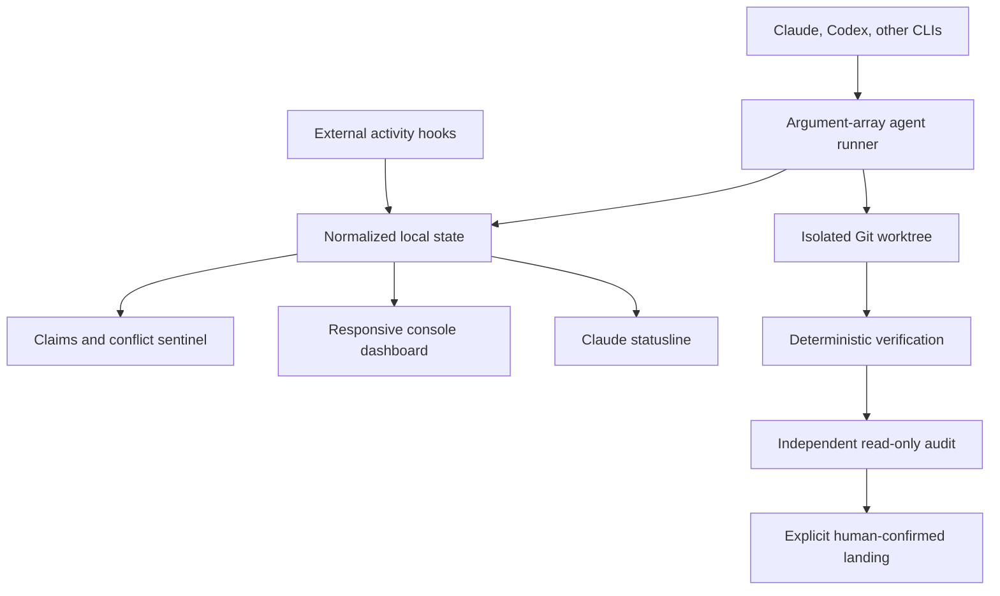
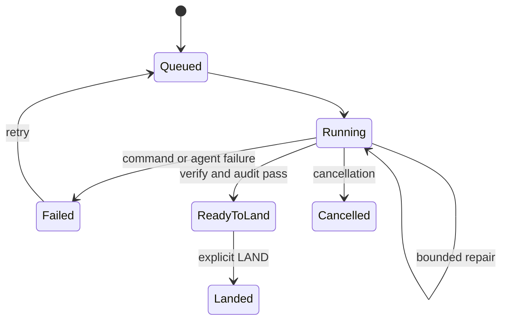

# Architecture

FKNRTD.CLI separates data collection, coordination, evidence, and rendering so the command center never becomes the source of truth by accident.

## Projects

| Project | Responsibility |
|---|---|
| `FKNRTD.Core` | Domain model, atomic state, CLI runners, Git worktrees, workflow, usage collectors, messages, claims, conflict detection |
| `FKNRTD.Cli` | Command parsing, interactive dashboard, statusline renderer, installation integration |
| `FKNRTD.SelfTest` | Dependency-free component and end-to-end validation |

## Normalized state

Built-in and custom agents all write the same `AgentRuntimeState`. The renderer does not need Claude-specific, Codex-specific, or IDE-specific branches after collection.

Only observable values are modeled:

- state and role
- task and visible intent
- process ID
- worktree and branch
- touched and planned paths
- explicit progress plus its measurement basis
- last exit code and freshness

FKNRTD.CLI never tries to expose an agent's hidden reasoning.

## Workflow state machine

Every task stores independent stage records for brief, worktree, plan, implementation, verification, audit, ready-to-land, and landing. This prevents a successful agent exit from being presented as verified, audited, or merged work.

## Process execution

Agent executables use `ProcessStartInfo.ArgumentList`; each configured argument remains a distinct operating-system argument. Prompt delivery can use an argument or standard input. No shell interprets agent prompts or paths.

Verification is intentionally different. A project owner configures commands such as `dotnet test`, and FKNRTD.CLI runs them through `cmd.exe` on Windows or `/bin/sh` on Unix. Treat `.fknrtd/config.json` as executable project policy and review changes to it.

## Git isolation and landing

Each task gets:

- a `fknrtd/<task>-<title>` branch
- an isolated worktree under `.fknrtd/worktrees`
- independent agent and verification logs
- brief, plan, and audit artifacts

The primary worktree remains the landing authority. Landing checks that it is clean and on the expected base branch. A failed merge is aborted, and the task remains failed for inspection.

## Conflict semantics

| Condition | Meaning | Risk |
|---|---|---:|
| Read plus read | Safe concurrent observation | 0 |
| Expired claim | Ownership may be abandoned | 25 |
| Overlap in separate worktrees | Future merge conflict is possible | 60 |
| Overlap in one physical worktree | Agents can overwrite each other now | 100 |

Exact paths, directories, `*`, `**`, and `?` patterns are supported. Runtime paths seen in structured agent output supplement explicit ownership leases.

## Usage collection

Claude usage is pushed through the statusline JSON. Codex usage is pulled on demand from app-server using this JSON-RPC sequence:

1. `initialize`
2. `initialized`
3. `account/rateLimits/read`

Codex windows are identified by reported duration. Only 300-minute and 10,080-minute buckets map to the dashboard's five-hour and weekly values. Missing buckets remain null and render as `N/A`.

The statusline reads cached Codex data. It does not start app-server or call a remote service on every redraw.

## Storage and concurrency

Mutable snapshots use a unique temporary file followed by atomic replacement. Append-only event and message streams use compact JSONL and a process-local write gate. A file held with `FileShare.None` is the exclusive lease for each running task.

Multiple FKNRTD.CLI processes may operate on different tasks. Dashboard parallelism is capped by `maxParallelAgents`; individual task locks remain the final duplicate-run guard.

## Rendering priority

The dashboard follows three levels:

1. Priority 0: collision, blocked work, failed build or tests, failed verification, stale ownership
2. Priority 1: repository, branch, task, activity, worktree, sync, pipeline
3. Priority 2: context, allowance, CPU, memory, timestamps

Priority 0 may displace Priority 2. The renderer uses independent layouts at narrow, medium, and wide widths instead of blindly truncating one large layout.
